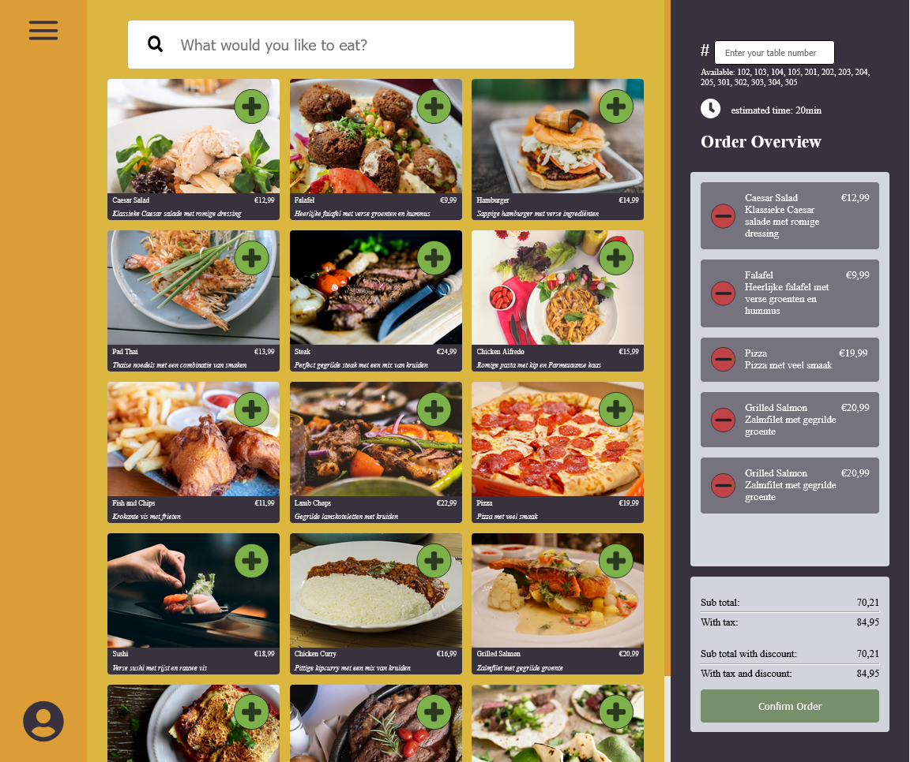

# Hotel California - Restaurant / Catering App

This application is designed to enhance efficiency and user experience in a restaurant or hotel environment. It streamlines the ordering process, involving both service and kitchen staff. The application provides a user-friendly interface for customers and staff, ensuring that orders can be processed quickly and efficiently.

<details>
  <summary>Click to view the image</summary>



</details>

## Features
- **Customer Ordering**: Customers can select menu items and place orders via the web application or through the staff at the table.
- **Kitchen Interface**: Kitchen staff can view orders, track their status, and mark dishes as prepared.
- **User Authentication**: Users, such as service and kitchen staff, must log in to access specific interfaces tailored to their role.
- **Order Management**: The system keeps detailed records of orders, including timestamps, status, and responsible personnel.
- **Anonymous Ordering**: Customers can place orders without logging in.
- **Reports and Analytics**: The application generates data and reports to help restaurant or hotel managers optimize operations.

## Requirements
To install and run the application, ensure the following software and configurations are present:

### Software
- **IntelliJ IDEA**: For developing and running the backend (Spring Boot application).
- **Maven**: For building and managing backend dependencies.
- **Java 21 SDK**: Required to run the backend.
- **WebStorm** (or another code editor): For developing and running the frontend (Vite application).
- **Node.js (version 18 or higher)**: For running the frontend and managing frontend dependencies.
- **PostgreSQL Server:** Required for running the PostgreSQL database (you can install it locally or use a cloud-hosted database). Make sure the server is running and accessible for your application.
- **pgAdmin (optional)**: For visually managing the PostgreSQL database.

### System Requirements
- **Memory**: At least 16 GB of RAM for optimal performance when running both frontend and backend.
- **Operating System**: The application is cross-platform and works on Windows, macOS, and Linux, provided the required software is installed.

## Installation

### Backend (Spring Boot)

1. **Clone the repository**:
   ```bash
   git clone https://github.com/mjerta/hotel-california-backend.git
   git clone git@github.com:mjerta/hotel-california-backend.git
   cd hotel-california-backend

### Frontend (REACT)
1. **Clone the repository**:
   ```bash
   git clone https://github.com/mjerta/hotel-california-frontend.git
   git clone git@github.com:mjerta/hotel-california-frontend.git
   cd hotel-california-frontend

## Files and Configurations

### .env File

The following .env files need to be in the root directory of the backend and frontend for the application to run successfully.

Note: Update default passwords and other sensitive information. The secret key should be replaced with a key that is at least 44 characters long.

#### .env - backend


- `APPLICATION_NAME=hotel-california-backend`
- `POSTGRES_HOST=localhost`
- `POSTGRES_PORT=5432`
- `POSTGRES_DB=hotel_california_backend`
- `POSTGRES_USERNAME=postgres`
- `POSTGRES_PASSWORD=default`
-
- `USER_SUPERADMIN=superadmin`
- `USER_SUPERADMIN_PASSWORD=default`
-
- `USER_MANAGER=manager`
- `USER_MANAGER_PASSWORD=default`
-
- `USER_STAFF=staff`
- `USER_STAFF_PASSWORD=default`
-
- `USER_CHEF=chef`
- `USER_CHEF=default`
-
- `USER_REGULAR=regular`
- `USER_REGULAR_PASSWORD=default`
- `SECRET_KEY=ZT8kd3@LmZ4pXs96F!cVw%2GsR5+Ln#jDpYb9&vRk6WxJjT*HpZd`

#### .env - frontend

If the backend is hosted on a different address, update the VITE_API_URL environment variable:

- `VITE_API_URL=http://localhost:8080`

### PostgreSQL Database

Create a PostgreSQL database with the name and credentials specified in the backend `.env` file (`POSTGRES_DB, POSTGRES_USERNAME, and POSTGRES_PASSWORD`). If a different database name is used, update it in the `.env` file as well.
